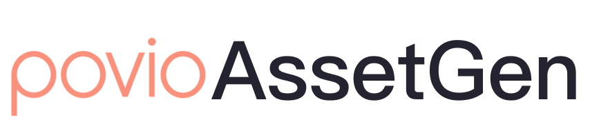

<p align="center">
      
</p>
<p align="center">
    <a href="https://www.swift.org" alt="Swift">
        
    </a>
    <a href="./LICENSE" alt="License">
        
    </a>
</p>

# AssetGen

AssetGen is a tool designed to streamline the localization process for iOS and Android platforms and asset management for iOS.
It provides a unified solution for generating localization files from a single source, Google Sheets.

There are several benefits of using the tool:

- Unified translation system for iOS and Android platforms

- Seamless integration with project workflows for automatic translation imports

- Minimized risk of typo errors in localization usage

- Enhanced productivity through intelligent auto-completion and semantic clarity

- Safeguard against referencing non-existent assets

## Installation

Currently we support the tool to install in Homebrew

via Homebrew:

```shell
$ brew tap poviolabs/assetgen
$ brew install assetgen
```

## Usage

AssetGen is a command-line tool which uses a configuration file to define the various functionalities.

Create a configuration file as a starting point to adapt as your needs, `assetgen.json` or any other `.json` file.

### Localization

The AssetGen tool allows users to manage localization data in Google Sheets, and generate output files that can be used in iOS and Android projects. Users can define keys and translations in Google Sheets, and specify different translations for different platforms, such as iOS and Android. To achieve this is needed to create a Google Sheet, get the sheet id and api key.

Then in the configuration file created you need to provide these data, like below:

```json
{
   "localization": {
        "apiKey": "<google_api_key>",
        "sheetId": "<google_spreadsheet_id>",
        "outputDirectory": "/path/to/Resources/Localization"
    }
}
```

Now you can run the tool in terminal, switch to your project directory and run:

```shell
$ assetgen localization:ios /path/to/assetgen.json
```
