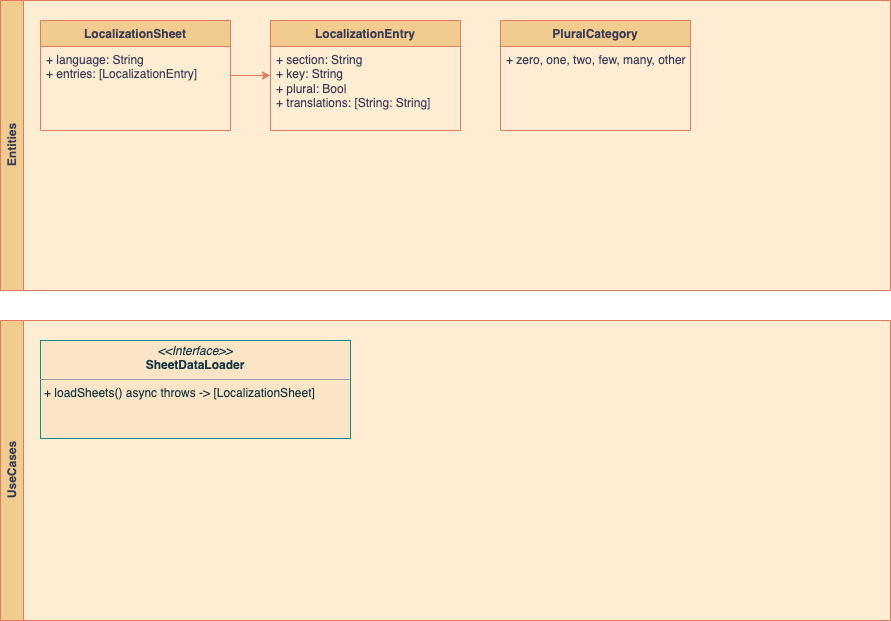

# Localization Domain

**Entities**:

- `LocalizationSheet`: Represents a localization sheet containing translation entries for the app.
- `LocalizationEntry`: Represents an entry with properties: section, key, plural and translations
- `PluralCategory`: Represents language plural categories defined by CLDR 

**Use Cases**:

- `SheetDataLoader`: A protocol that defines the contract for loading sheet data.

**Diagram**:

