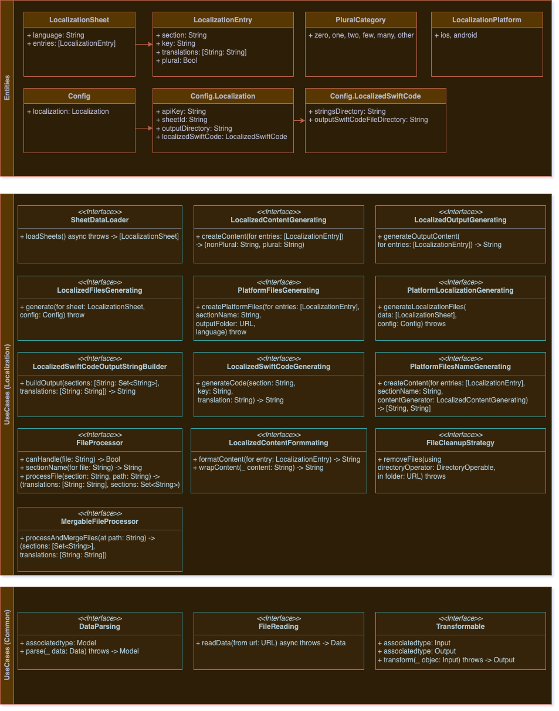

# Localization Domain

**Entities**:

- `LocalizationSheet`: Represents a localization sheet containing translation entries for the app.
- `LocalizationEntry`: Represents an entry with properties: section, key, plural and translations
- `PluralCategory`: Represents language plural categories defined by CLDR
- `Config`: Represents an app configuration needed to perform localization
- `LocalizationPlatform`: Represents localization platforms that will be supported by the app. 

**Use Cases**:

    **Localization**

- `SheetDataLoader`: A protocol that defines the contract for loading sheet data.
- `LocalizedContentGenerating`: A protocol that defines the contract creating the localization plural/nonPlural content.
- `LocalizedOutputGenerating`: A protocol that defines the contract for generating the output content for given platform.
- `LocalizedFilesGenerating`: A protocol that defines a method to generate localized files from a given localization sheet and configuration.
- `PlatformFilesGenerating`: A protocol that dictates a method to create platform-specific localization files from given localization entries.
- `PlatformFilesNameGenerating`:  A protocol that defines a method to create contents for platform-specific localization files.
- `PlatformLocalizationGenerating`: A protocol that outlines a method to generate localization files for a platform from given localization sheets and configuration.
- `LocalizedSwiftCodeOutputStringBuilder`: A protocol that defines a method to build a string output from given sections and translations data.
- `LocalizedSwiftCodeGenerating`: A protocol that provides a method to generate Swift code for localization from given section, key, and translation.
- `LocalizedCodeFileGenerating`:  A protocol that lays down a method to generate localized code files from a given input and output path.
- `MergableFileProcessor`: A protocol that specifies a method to process and merge multiple files at a given path into a structured data representation.
- `FileProcessor`:  A protocol that defines methods to handle and process a given file, and to derive a section name.
- `LocalizedContentFormatting`: A protocol that outlines methods for formatting localized content.
- `FileCleanupStrategy`: A protocol that defines a strategy to clean up files in a specific folder using a directory operator.

    **Common**

- `DataParsing`: A protocol that provides a method for parsing raw data into a specific model.  The `Model` associated type is the type of object the conforming type can parse the data into.
- `FileReading`: A protocol that defines a method for asynchronously reading data from a specified URL.
- `Transformable`: A protocol that provides a method to transform an object of type `Input` to an object of type `Output`. The `Input` and `Output` associated types are the types of objects the conforming type can transform between.

**Diagram**:

