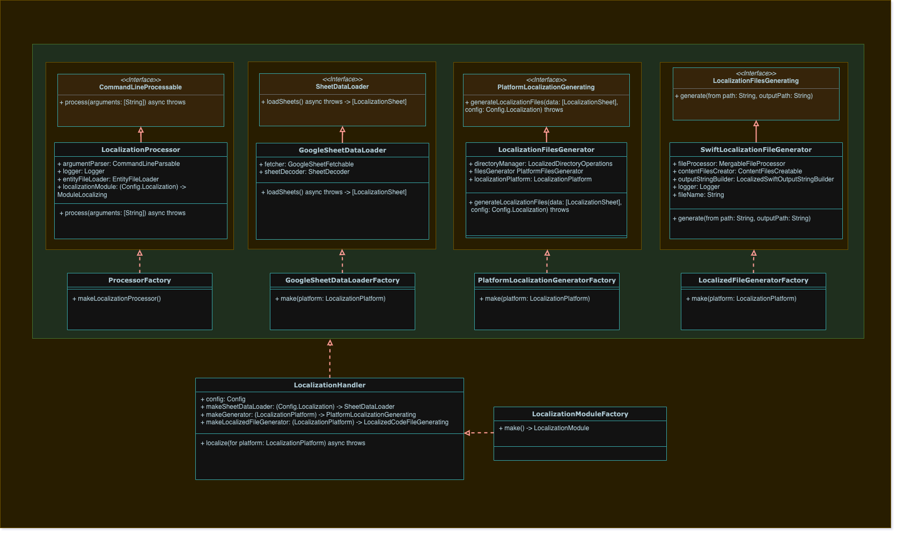

# Lingua

## Introduction

Lingua is an asynchronous and efficient tool designed to process and generate localization data. It is intended to be used within the command line interface and leverages the swift concurrency model. It allows you to specify configuration details for localizing your project, including options for different localization platforms.

## Overview

This tool is composed of two primary classes:

- `LocalizationProcessor`: Responsible for processing command line arguments, loading the configuration file, creating the localization module and invoking the localization process.

- `LocalizationModule`: Responsible for generating the localization data based on the given configuration and platform.

## Architecture

Lingua tool is built using the principles of Clean Architecture, which clearly segregates the software into independent layers, making it easy to maintain, test, and scale. Below, we dive into the structure of these layers:

### 1. Domain Layer

The Domain Layer encapsulates the core business logic of the application, independent of any specific technology or external application layer.

The main components of this layer in the LocalizationModule tool are:

- **Entities**: These are the business objects of the application. They encapsulate the most general and high-level rules of the software.

- **Use Cases**: These contain specific business rules that describe all the ways the software can be used to interact with the entities.

### 2. Infrastructure Layer

The Infrastructure Layer is where all the technological details and tools used by the application live. It serves to support the upper layers without influencing their rules.

The main components of this layer in the LocalizationModule tool are:

- **Networking**: Handles all networking tasks within the application, providing data to the application layer and domain layer.

- **Data**: Contains all data access and storage components, such as databases and data sources.

- **DirectoryOperations**: Performs operations on directories, such as reading, writing, and manipulating files.

- **LocalizationGenerator**: Responsible for generating localization files based on the provided data and configuration.

- **Logger**: Handles all logging operations within the application.

- **SwiftLocalizeGenerator**: Specific component responsible for generating localized Swift code files.

### 3. Application Layer

The Application Layer sits at the highest level of the architecture. It is concerned with user interfaces and presentation but contains no business logic. In the LocalizationModule tool, it's a Command Line App that handles:

- **Processing Command Line Arguments**: It interprets user inputs provided through the terminal and translates them into actions to be taken by the underlying layers.

- **Composing Dependencies**: It wires together the different parts of the application, deciding which implementations of the interfaces defined in the Domain Layer should be used at runtime.

This architecture provides several benefits, including independence of frameworks, testability, independence of the UI, independence of the database, and the flexibility to adapt to changing business realities.

Read more:

| Module                                              | Description                                                                                                                                                                                                                                                                               |
| --------------------------------------------------- | ----------------------------------------------------------------------------------------------------------------------------------------------------------------------------------------------------------------------------------------------------------------------------------------- |
|                                                     |                                                                                                                                                                                                                                                                                           |
| [Domain](./Domain/DOMAIN.md)                        | The domain layer is the core of our app, encapsulating its business logic and the entities that represent its main objects. This layer is responsible for defining the rules and behavior of the app's features and provides a clean separation of concerns between the app's components. |
| [Networking](./Infrastructure/Networking/README.md) | A simple, scalable, and testable networking layer                                                                                                                                                                                                                                         |

## Usage

### Command Line Interface

The LocalizationModule is primarily designed to be used via the command line interface. To run it, use the following command:

`Lingua <platform> <config_file_path/file.json>`

Where `<platorm>` can be `ios` or `android`.

### LocalizationProcessor

You can initialize `LocalizationProcessor` with the following parameters:

- `argumentParser`: An object conforming to `CommandLineParsable` to parse command line arguments.
- `logger`: A `Logger` object to handle logging information.
- `entityFileLoader`: An `EntityFileLoader` object to load the configuration entity.
- `localizationModuleFactory`: A closure to create an instance of `ModuleLocalizing` to perform the localization process.

After initialization, call the `process(arguments:)` method on the `LocalizationProcessor` instance to start the processing.

### LocalizationModule

Initialize `LocalizationModule` with the following parameters:

- `config`: The localization configuration.
- `makeSheetDataLoader`: A closure that creates a `SheetDataLoader` for loading sheets.
- `makePlatformGenerator`: A closure that creates a `PlatformLocalizationGenerating` for generating platform-specific localization files.
- `makeLocalizedFileGenerator`: A closure that creates a `LocalizedCodeFileGenerating` for generating localized code files.

Call the `localize(for:)` method on the `LocalizationModule` instance to start the localization process.

## Error Handling

Errors are handled by catching thrown `ProcessorError` types. These include `.missingLocalization` which indicates that the configuration is missing localization details.

## Extensibility

The LocalizationModule is designed with extensibility in mind, allowing you to supply your own implementations of various interfaces such as `CommandLineParsable`, `SheetDataLoader`, `PlatformLocalizationGenerating`, and `LocalizedCodeFileGenerating`.

## Diagram

